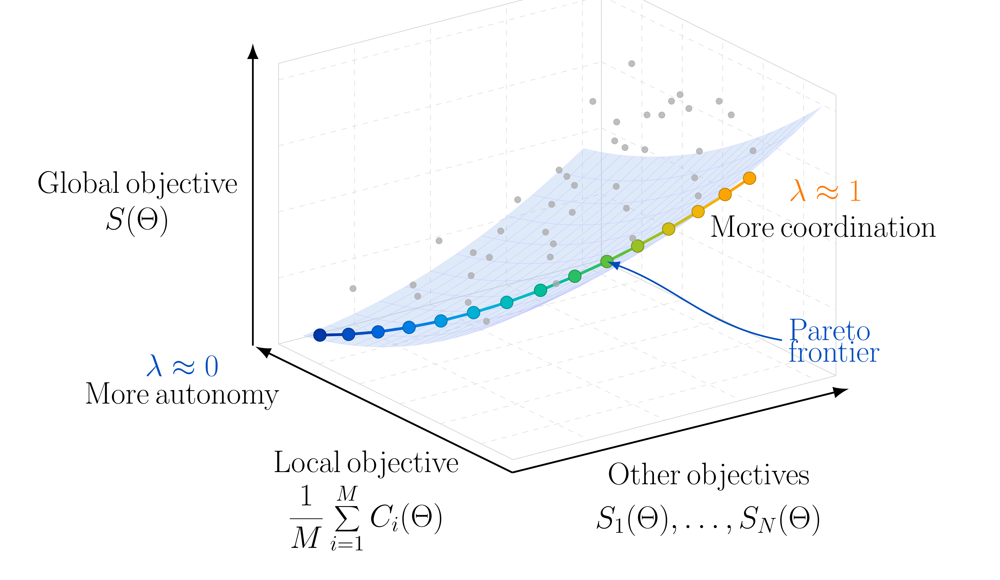

# Multi-Objective Optimization for Decentralized Learning

This repository accompanies the paper [*A Multi-Objective Optimization Framework for Decentralized Learning with Coordination Constraints*](https://arxiv.org/abs/2507.13983).
It applies a multi-objective optimization strategy to federated learning (FL): several participating devices or clients—called *agents*—train a shared 
model on their own local data, while a *central coordinator* represents an additional system-wide goal. 
Rather than treating FL as the minimization of local training losses alone, the coordinator contributes a separate objective, such as regularization, 
fairness, robustness, or structural consistency. The method therefore learns a model that balances the agents' data-driven objectives with 
the coordinator's global preference, without moving the agents' local data to the coordinator.

The examples use MNIST handwritten-digit classification. Five agents train copies of a small convolutional neural network on private data, 
perform local updates, and then share model parameters through averaging. The distinctive feature is that the coordinator contributes an 
additional objective—in these experiments, a parameter regularization term—which is included in every local update.

## Motivation

Standard decentralized or federated learning usually combines updates from agents that are assumed to pursue one common objective. 
In realistic systems, agents may have different data or priorities, while a coordinator may need to promote system-wide requirements such 
as fairness, robustness, regularization, or structural consistency.

We model this as a multi-objective problem over the shared model parameters:
```math
\min_{\Theta \in U} \bigl(C_1(\Theta), \ldots, C_M(\Theta), S_1(\Theta), \ldots, S_N(\Theta)\bigr).
```

Here, each `C_i` is an agent's empirical training objective and each `S_j` is a coordinator objective. Usually no single model improves 
every objective simultaneously, so the aim is to find a sensible Pareto trade-off rather than one universal optimum.



## Approach implemented 

The notebooks use weighted scalarization to turn the competing objectives into one trainable loss. The parameter `LAMBDA_STAR` (`λ`) controls the trade-off:
- `λ = 0` gives full priority to local training objectives.
- Larger values give more influence to the coordinator's objective.
- Values close to `1` strongly constrain local learning and may make optimization less stable.

At every communication round, each agent starts from the current shared model, trains locally for one epoch using its data and the coordinator-aware loss, and sends its updated parameters for averaging. This retains decentralized local computation while allowing the coordinator's preference to shape the updates. Under the paper's convexity, smoothness, and stochastic-gradient assumptions, the associated scalarized method has convergence guarantees and its solutions are weakly Pareto optimal (Pareto optimal when the scalarized solution is unique).

## Experiments

| Notebook | Data allocation | What it investigates |
| --- | --- | --- |
| [`Exp01_IID.ipynb`](Exp01_IID.ipynb) | Each of the five agents receives a random, class-representative MNIST partition. | How stronger coordination affects learning when all agents see statistically similar data. |
| [`Exp02_nonIID.ipynb`](Exp02_nonIID.ipynb) | Each agent receives images from only two digit classes: `{2,8}`, `{4,9}`, `{1,6}`, `{3,7}`, and `{0,5}`. | How coordinator guidance can counter local-model drift when agent data are highly heterogeneous. |

## Requirements

Use Python 3.10 or newer with Jupyter and the following packages:

```bash
pip install jupyter torch torchvision numpy matplotlib scikit-learn
```

GPU support is optional. The notebooks can run on CPU, although training will take longer.

## Running the simulations

From this directory, launch Jupyter:

```bash
jupyter notebook
```

Open and run either notebook from top to bottom. To explore the coordination trade-off, edit `LAMBDA_STAR` in the training cell (and keep any earlier configuration value consistent). The notebooks save generated plots in `figures_exp_iid/` and `figures_exp02/`, respectively.

## Reference

R. Morales and U. Biccari, *A Multi-Objective Optimization Framework for Decentralized Learning with Coordination Constraints*, 2025. [arXiv:2507.13983](https://arxiv.org/abs/2507.13983).

## Funding

This project has received funding from the European Research Council (ERC) under the European Union's Horizon 2030 research and innovation programme (grant agreement No. 101096251, CoDeFeL).

 
